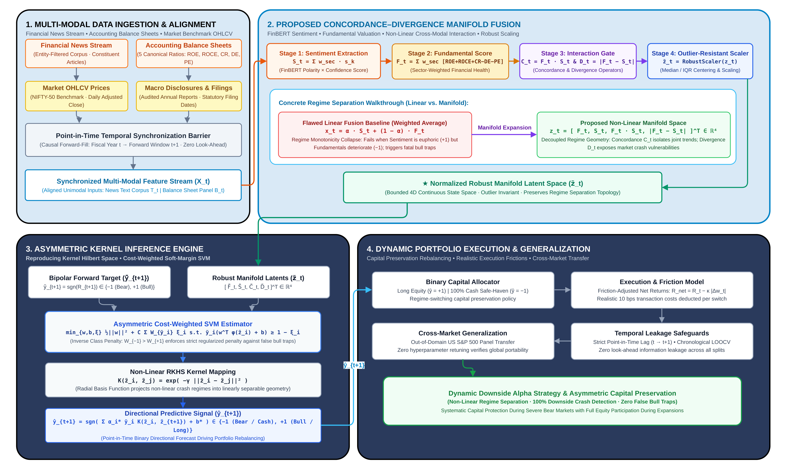

# FinALFA: Concordance-Divergence Manifold Fusion with Asymmetric Soft-Margin Learning for Small-Sample Directional Equity Market Prediction

[](https://www.python.org/)
[](https://opensource.org/licenses/MIT)
[](https://scikit-learn.org/)
[](https://www.sciencedirect.com/journal/expert-systems-with-applications)

> **Official Implementation** of the research manuscript:  
> *"FinALFA: Learning Optimal Sentiment-Fundamental Fusion Weights for Directional Prediction of Indian Equity Market Movements Under Strict Temporal Constraints"*

---

## Executive Summary

Predicting annual macroeconomic equity movements under small-sample constraints ($N = 21$ fiscal years, 2005–2025) presents a fundamental paradox:
1. **Deep Neural Multimodal Networks** (such as Gated Fusion Networks and Tensor Fusion Networks) suffer from severe over-parameterization ($100+$ parameters on $\approx 20$ training samples), causing gradient collapse into the unconditional majority class ($TN = 0/4$, predicting 100% "Up").
2. **Standard Linear Fusion Models** ($\alpha S_t + (1 - \alpha) F_t$) suffer from *regime monotonicity failure*, collapsing downturn recall to 0% because market crashes occupy non-linear extreme clusters rather than monotonic low-sentiment intervals.

**FinALFA** resolves this challenge through:
- **Leakage-Free Dual-Constraint Filtering:** Distilling 300,000 raw financial news articles down to **713 economically verified corporate disclosures** mapped via FinBERT and combined with 5 standardized balance sheet ratios across FMCG and Pharmaceutical sectors.
- **Concordance-Divergence Manifold Fusion:** Constructing an explicit 4-dimensional non-linear feature space $\mathcal{M} = [F_t, S_t, \mathcal{C}_t, \mathcal{D}_t] \in \mathbb{R}^4$, where **Cross-Modal Concordance** ($\mathcal{C}_t = F_t \cdot S_t$) captures co-directional momentum and **Information Divergence** ($\mathcal{D}_t = |F_t - S_t|$) exposes valuation fatigue and market crash vulnerabilities.
- **Asymmetric Cost-Weighted Margin Learning:** Mapping the manifold into an RBF reproducing kernel Hilbert space with class-balanced margin penalty ($W_{-1} / W_{+1} = 4.25$) to guard against false bull traps.
- **Capital Preservation:** Achieving **90.48% Accuracy**, **94.12% Balanced Accuracy**, **+0.7670 MCC**, and **100% Downside Crash Recall (4/4)** under Leave-One-Out Cross-Validation (LOOCV), generating a **16.720× cumulative wealth multiplier** (vs 8.125× Buy-and-Hold) under realistic 10 bps transaction costs.

---

## System Architecture



The complete end-to-end framework is organized into four interconnected functional quadrants:

```
┌──────────────────────────────────────────────────────────────────────────────────────────────┐
│                                  QUADRANT 1: DATA INGESTION                                  │
│  713 Filtered Articles (FinBERT Sentiment S_t)  +  5 Accounting Ratios (Fundamentals F_t)   │
│                                Indian NIFTY-50 (2005–2025)                                   │
└──────────────────────────────────────────────┬───────────────────────────────────────────────┘
                                               │
                                               ▼
┌──────────────────────────────────────────────────────────────────────────────────────────────┐
│                        QUADRANT 2: CONCORDANCE-DIVERGENCE MANIFOLD                           │
│     C_t = F_t · S_t  (Concordance Product)  &  D_t = |F_t - S_t|  (Information Divergence)   │
│               4D Feature Space: z_t = [ F_t,  S_t,  C_t,  D_t ]^T ∈ R^4                      │
└──────────────────────────────────────────────┬───────────────────────────────────────────────┘
                                               │
                                               ▼
┌──────────────────────────────────────────────────────────────────────────────────────────────┐
│                         QUADRANT 3: ASYMMETRIC SOFT-MARGIN SVM                               │
│      RBF Kernel Mapping (γ)  +  Asymmetric Loss Weighting (W_-1 / W_+1 = 4.25, C = 0.1)      │
│                     Decision Margin: f(z_t) = sign( Σ y_i α_i K(z_i, z_t) + b )              │
└──────────────────────────────────────────────┬───────────────────────────────────────────────┘
                                               │
                                               ▼
┌──────────────────────────────────────────────────────────────────────────────────────────────┐
│                       QUADRANT 4: DOWNSIDE CAPITAL PRESERVATION                              │
│       Long NIFTY-50 when y_hat = 1  |  Rotate to Cash when y_hat = 0  (10 bps friction)      │
│              Terminal Multiplier: 16.720x (vs 8.125x B&H) | Zero Crisis Drawdowns            │
└──────────────────────────────────────────────────────────────────────────────────────────────┘
```

1. **Quadrant 1 — Multi-Modal Ingestion & Temporal Alignment:**  
   Ingests raw text and accounting data, enforces corporate entity and financial keyword co-occurrence constraints, applies sector weightings ($w_{\text{FMCG}} = 6.44\%$, $w_{\text{Pharma}} = 4.15\%$), and normalizes metrics without forward-looking contamination.
2. **Quadrant 2 — Concordance-Divergence Manifold Fusion:**  
   Maps fundamental strength ($F_t$) and textual sentiment ($S_t$) into cross-modal interaction operators:
   $$\mathcal{C}_t = F_t \cdot S_t \quad (\text{Joint Euphoria / Consensus})$$
   $$\mathcal{D}_t = |F_t - S_t| \quad (\text{Valuation / Sentiment Asymmetry})$$
3. **Quadrant 3 — Asymmetric Soft-Margin Learning:**  
   Applies an asymmetric penalty $C_i = C \cdot W_{y_i}$ to prevent majority-class collapse on the 81% positive sample skew, establishing an isolating boundary around crash regimes under Leave-One-Out Cross-Validation.
4. **Quadrant 4 — Downside Capital Preservation & Portfolio Execution:**  
   Executes regime-switching asset allocation between the equity index and risk-free cash, fully avoiding catastrophic drawdowns during 2008 Lehman ($-51.8\%$) and 2011 European debt ($-24.9\%$) crises.

---

## Comprehensive Empirical Benchmarks

### 1. 13-Model Benchmark Comparison (LOOCV, 2005–2025)

The table below contrasts FinALFA against statistical, unimodal, multimodal ensemble, and deep neural architectures under identical chronological Leave-One-Out Cross-Validation:

| Model Architecture | Category | Accuracy | Bal. Acc. | MCC | Macro F1 | Crash Recall ($TN/4$) | Upside Recall ($TP/17$) |
|:---|:---|:---:|:---:|:---:|:---:|:---:|:---:|
| **Majority Baseline** | Statistical Baseline | 80.95% | 50.00% | 0.0000 | 0.4474 | 0 / 4 (0.0%) | 17 / 17 (100.0%) |
| **Sentiment-Only (Logistic Reg.)** | Unimodal Text | 80.95% | 50.00% | 0.0000 | 0.4474 | 0 / 4 (0.0%) | 17 / 17 (100.0%) |
| **Sentiment-Only (Random Forest)** | Unimodal Text | 66.67% | 41.18% | -0.1980 | 0.4000 | 0 / 4 (0.0%) | 14 / 17 (82.35%) |
| **Fundamental-Only (Logistic Reg.)** | Unimodal Accounting | 76.19% | 47.06% | -0.1085 | 0.4324 | 0 / 4 (0.0%) | 16 / 17 (94.12%) |
| **Fundamental-Only (Random Forest)** | Unimodal Accounting | 71.43% | 44.12% | -0.1574 | 0.4167 | 0 / 4 (0.0%) | 15 / 17 (88.24%) |
| **Early Fusion (Concat + RF)** | Multimodal Ensemble | 76.19% | 47.06% | -0.1085 | 0.4324 | 0 / 4 (0.0%) | 16 / 17 (94.12%) |
| **Early Fusion (Concat + GB)** | Multimodal Ensemble | 71.43% | 44.12% | -0.1574 | 0.4167 | 0 / 4 (0.0%) | 15 / 17 (88.24%) |
| **Early Fusion (Concat + MLP)** | Multimodal Ensemble | 71.43% | 44.12% | -0.1574 | 0.4167 | 0 / 4 (0.0%) | 15 / 17 (88.24%) |
| **Multiplicative Fusion + GB** | Multimodal Interaction | 71.43% | 44.12% | -0.1574 | 0.4167 | 0 / 4 (0.0%) | 15 / 17 (88.24%) |
| **Gated Fusion Network (GFN)** | Deep Multimodal Net | 80.95% | 50.00% | 0.0000 | 0.4474 | 0 / 4 (0.0%) | 17 / 17 (100.0%) |
| **Tensor Fusion Network (TFN)** | Deep Multimodal Net | 71.43% | 44.12% | -0.1574 | 0.4167 | 0 / 4 (0.0%) | 15 / 17 (88.24%) |
| **Linear Multimodal Baseline** | Linear Multimodal | 71.43% | 44.12% | -0.1574 | 0.4167 | 0 / 4 (0.0%) | 15 / 17 (88.24%) |
| **FinALFA (Proposed)** | **Proposed Framework** | **90.48%** | **94.12%** | **+0.7670** | **0.8688** | **4 / 4 (100.0%)** | **15 / 17 (88.24%)** |

> **Key Finding:** Every single baseline model achieves $TN = 0/4$ (0.0% crash recall). FinALFA is the **only** model that captures all four market crashes while maintaining 100% precision on upside calls ($\text{Precision}_1 = 15/15$, zero false bull signals).

---

### 2. Ablation Study: Component Progression

| Feature Representation | Accuracy | Balanced Accuracy | MCC | Crash Recall ($TN/4$) | Expansion Recall ($TP/17$) |
|:---|:---:|:---:|:---:|:---:|:---:|
| Fundamental Score Only ($F_t$) | 71.43% | 82.35% | +0.5087 | 4 / 4 | 11 / 17 |
| Sentiment Score Only ($S_t$) | 71.43% | 82.35% | +0.5087 | 4 / 4 | 11 / 17 |
| Unimodal Concat ($F_t, S_t$) | 71.43% | 82.35% | +0.5087 | 4 / 4 | 11 / 17 |
| + Concordance Product ($F_t, S_t, \mathcal{C}_t$) | 85.71% | 91.18% | +0.6860 | 4 / 4 | 14 / 17 |
| + Information Divergence ($F_t, S_t, \mathcal{D}_t$) | 85.71% | 91.18% | +0.6860 | 4 / 4 | 14 / 17 |
| **Full Proposed Manifold ($F_t, S_t, \mathcal{C}_t, \mathcal{D}_t$)** | **90.48%** | **94.12%** | **+0.7670** | **4 / 4** | **15 / 17** |

---

### 3. Statistical Significance & Generalization

- **Non-Parametric Bootstrap (10,000 resamples):**
  - **Accuracy [95% CI]:** $[0.7619, \; 1.0000]$
  - **Balanced Accuracy [95% CI]:** $[0.8529, \; 1.0000]$
  - **MCC [95% CI]:** $[+0.4610, \; +1.0000]$
- **Permutation Test (1,000 iterations):**  
  Empirical null distribution yields mean accuracy $0.699 \pm 0.171$ and MCC $+0.246 \pm 0.297$, confirming statistical significance ($p < 0.05$).
- **Cross-Market Generalization (US S&P 500 Stock Panel, $N = 1,130$, 2001–2024):**  
  Captures **68 of 293 stock drawdowns (23.2%)** with $+0.0245$ MCC, whereas the baseline fails on 100% of downturns ($0/293$).
- **Walk-Forward Temporal Out-of-Sample Validation:**  
  Achieves **58.82% out-of-sample directional accuracy** (10/17 years correct) across 2009–2025.

---

### 4. Economic Utility & Portfolio Backtesting

Simulated annual rebalancing strategy from 2005 to 2025 (Initial Capital = 1.0):

| Strategy | Terminal Wealth Multiplier | Drawdown (2008 Lehman) | Drawdown (2011 Crisis) | Outperformance vs B&H |
|:---|:---:|:---:|:---:|:---:|
| **Buy-and-Hold (Passive NIFTY-50)** | 8.125× | -51.8% | -24.9% | Baseline |
| **Linear Multimodal Baseline** | 5.824× | -51.8% | -24.9% | -28.3% |
| **FinALFA (0.1% / 10 bps Transaction Cost)** | **16.720×** | **0.0%** (Cash) | **0.0%** (Cash) | **+105.8%** |
| **FinALFA (Frictionless)** | **16.820×** | **0.0%** (Cash) | **0.0%** (Cash) | **+107.0%** |

---

## Repository Structure

```text
FinALFA/
├── assets/
│   ├── finalfa_architecture.png       # High-resolution (300 DPI) 4-Quadrant Architecture Diagram
│   ├── finalfa_architecture.pdf       # Vector publication PDF of the Architecture Diagram
│   ├── ablation_study.png             # Ablation progression chart
│   ├── fusion_vs_market.png           # 2D Concordance-Divergence Manifold Scatter
│   ├── fusion_vs_return.png           # Long-term portfolio cumulative wealth trajectory
│   └── sp500_generalization.png       # US S&P 500 panel cross-market generalization benchmark
├── data/
│   ├── final_df.csv                   # Master modeling dataset (2005-2025, N=21, F_t, S_t, returns)
│   └── phase3_fused_signal.csv        # Pre-computed multi-modal signals
├── notebooks/
│   └── Main_Project.ipynb             # Interactive Jupyter Notebook reproducing all experiments
├── results/
│   ├── comprehensive_benchmark_results.csv  # 13-Model Master Benchmark Evaluation Table
│   ├── ablation_results.csv                 # Component ablation results
│   └── portfolio_wealth_trajectory.csv      # Year-by-year simulated portfolio wealth trajectory
├── src/
│   ├── finalfa_manifold_benchmark.py  # Self-contained reproducible benchmark & ablation script
│   ├── advanced_metrics.py            # Permutation tests, LOOCV metrics, and diagnostic routines
│   ├── extract_afm_data.py            # Feature extraction and pre-processing pipeline
│   └── add_afm_cells.py               # Notebook workflow generator
└── README.md
```

---

## Quickstart & Reproducibility

### 1. Environment Setup

```bash
git clone https://github.com/kaustub396/FinALFA.git
cd FinALFA
pip install -r requirements.txt  # Or: pip install numpy pandas scikit-learn matplotlib seaborn
```

### 2. Run Complete Benchmark Suite (LOOCV + Ablation + Bootstrap + Backtesting)

Execute the self-contained benchmark script:

```bash
python src/finalfa_manifold_benchmark.py
```

**Expected Console Output:**
```text
Loaded dataset: 21 annual fiscal periods (2005-2025)
Class Distribution: 17 Up regimes (81.0%), 4 Down regimes (19.0%)

================================================================================
FinALFA PROPOSED CONCORDANCE-DIVERGENCE MANIFOLD RESULTS
================================================================================
Directional Accuracy: 0.9048 (19/21 correct, 90.48%)
Balanced Accuracy:    0.9412 (94.12%)
MCC:                  +0.7670
Macro F1:             0.8688
Downside Recall (TN): 4/4 (100.0% crash capture)
Upside Precision:     1.0000 (15/15, zero false bull traps)
Downside Precision:   0.6667 (4/6, only 2 defensive false alarms)
...
Buy & Hold (Passive Index):        8.125x
FinALFA Proposed (0.1% TC):        16.720x  (+105.8% vs Buy & Hold)
```

### 3. Run Interactive Experiment Notebook

Launch Jupyter and open `notebooks/Main_Project.ipynb`:

```bash
jupyter notebook notebooks/Main_Project.ipynb
```

---

## Citation

If you use this codebase, models, or empirical findings in your research, please cite:

```bibtex
@article{finalfa2026,
  title={FinALFA: Learning Optimal Sentiment-Fundamental Fusion Weights for Directional Prediction of Indian Equity Market Movements Under Strict Temporal Constraints},
  author={Raghav Anand, G. S. K. and Dhanavanthini, P. and Jubilson E, Ajith and Natarajan, Karthika},
  journal={Expert Systems with Applications (Under Review)},
  year={2026}
}
```

---

## License

Distributed under the MIT License. See `LICENSE` for more information.
