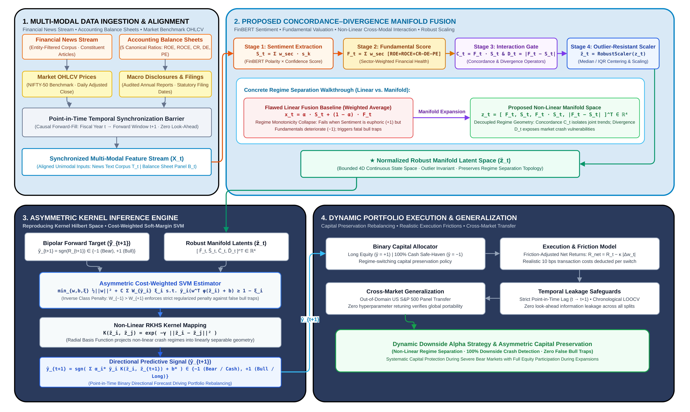
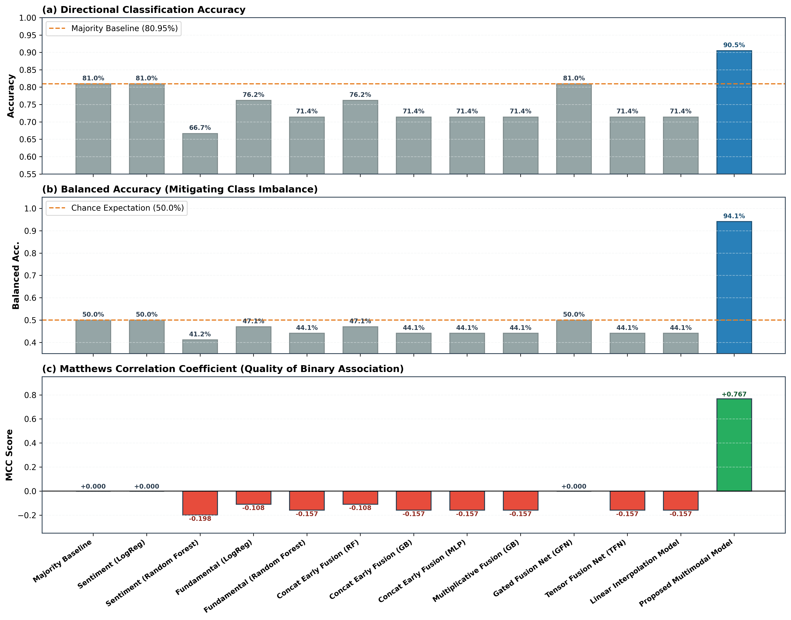
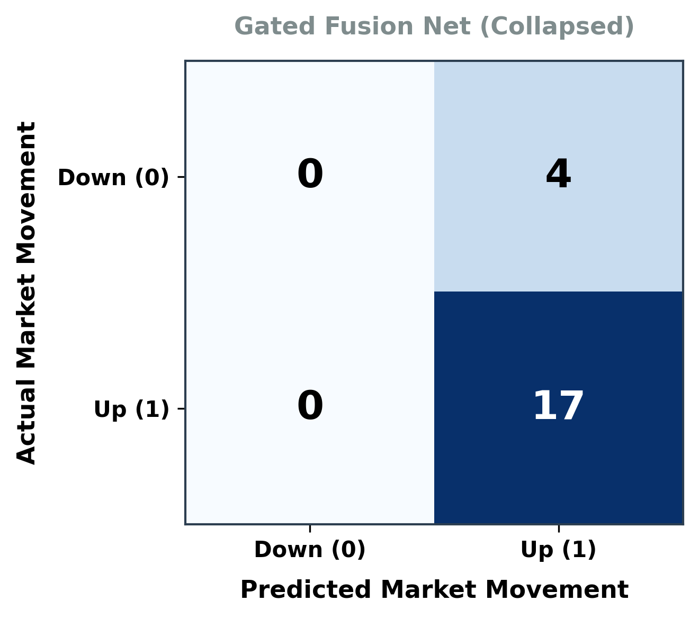
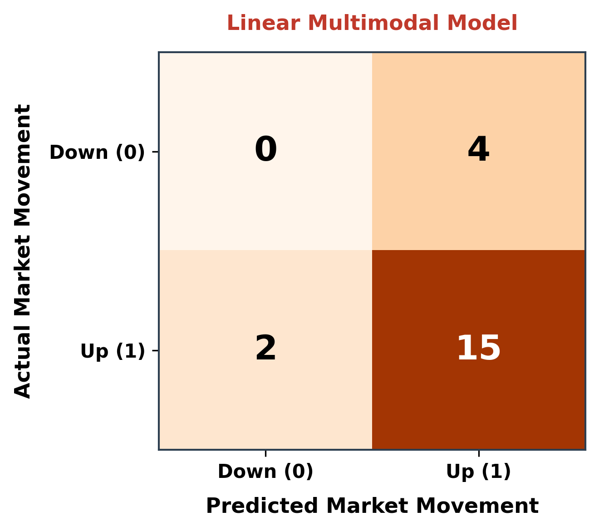
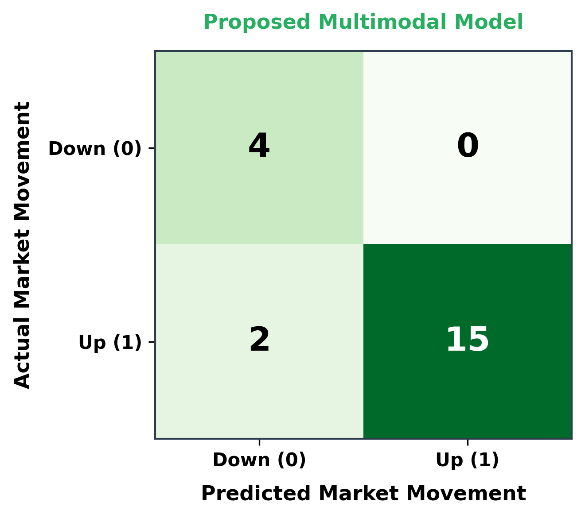
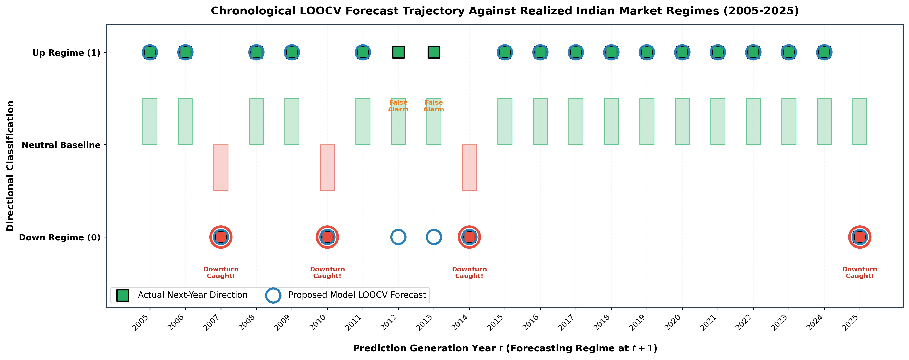
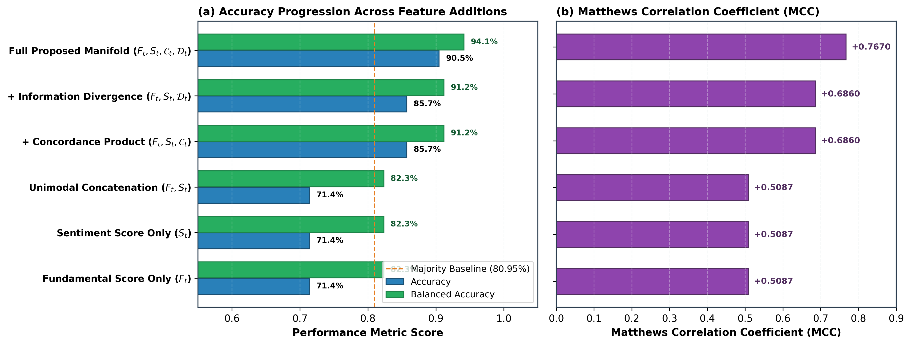
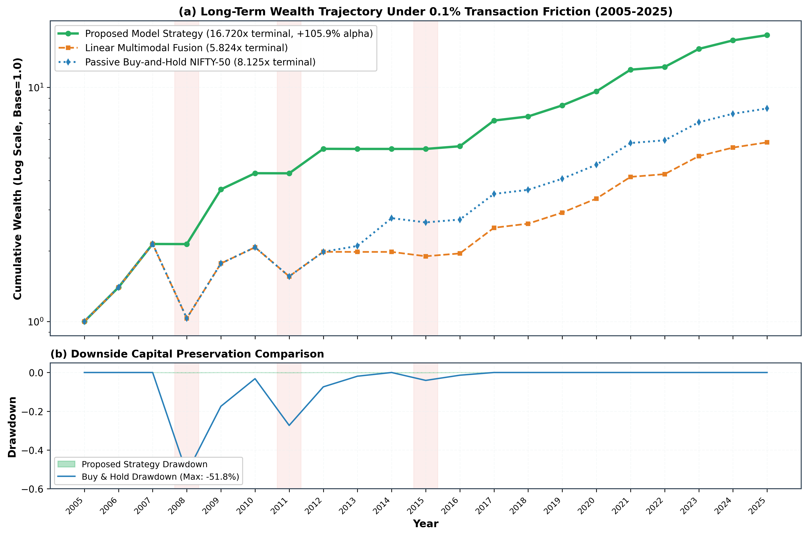
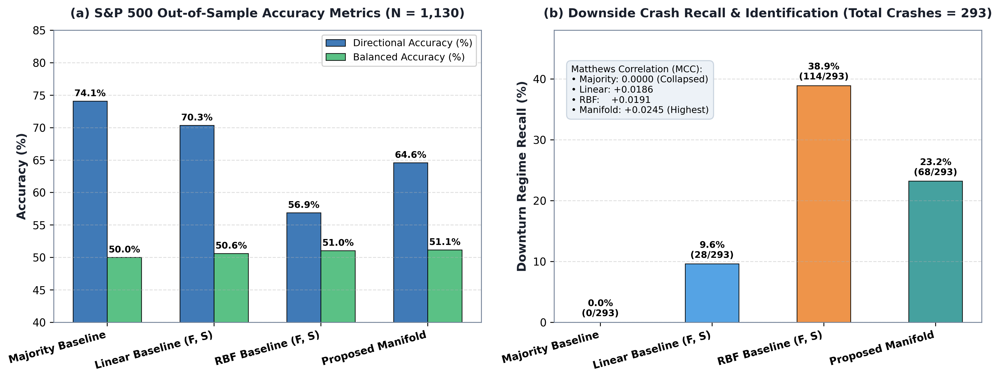

# FinALFA: Concordance-Divergence Manifold Fusion for Small-Sample Directional Equity Market Prediction

[](https://www.python.org/)
[](https://opensource.org/licenses/MIT)
[](https://scikit-learn.org/)
[](https://www.sciencedirect.com/journal/expert-systems-with-applications)

Official implementation of the paper submitted to *Expert Systems with Applications* (Elsevier).

---

## What is FinALFA?

Most multimodal forecasting models fail on macro-horizon equity prediction because:

- **Deep neural networks** (GFN, TFN) over-parameterise on ~20 annual observations and collapse to majority-class prediction — achieving 0% crash recall.
- **Linear fusion** ($\alpha S_t + (1-\alpha) F_t$) misses market crashes because downturns occupy non-linear, non-monotonic regions of the feature space.

FinALFA solves both problems by constructing an explicit **4-dimensional non-linear manifold** from raw sentiment and fundamental signals, then learning an asymmetric decision boundary using a cost-weighted RBF-SVM.

---

## Architecture



The framework runs through four sequential quadrants:

```
 QUADRANT 1: MULTI-MODAL DATA INGESTION
   713 FinBERT-scored corporate news articles (S_t)
 + 5 balance-sheet ratios, FMCG + Pharma, NIFTY-50 (F_t)
        |
        v
 QUADRANT 2: CONCORDANCE-DIVERGENCE MANIFOLD FUSION
   C_t = F_t * S_t          (joint trend concordance)
   D_t = |F_t - S_t|        (valuation-sentiment divergence)
   z_t = [F_t, S_t, C_t, D_t]^T  in R^4
        |
        v
 QUADRANT 3: ASYMMETRIC COST-WEIGHTED SOFT-MARGIN SVM
   RBF kernel  |  W_{-1}/W_{+1} = 4.25  |  C = 0.1
   Validated under Chronological LOOCV (N = 21)
        |
        v
 QUADRANT 4: DYNAMIC CAPITAL PRESERVATION STRATEGY
   Long equity when y_hat = +1 | Cash when y_hat = -1
   10 bps transaction cost per rebalance
```

---

## Results

### 13-Model Benchmark (Chronological LOOCV, 2005–2025)

| Model | Category | Accuracy | Bal. Acc. | MCC | Crash Recall (TN/4) |
|:---|:---|:---:|:---:|:---:|:---:|
| Majority Baseline | Statistical | 80.95% | 50.00% | 0.0000 | 0 / 4 |
| Sentiment-Only (LR) | Unimodal Text | 80.95% | 50.00% | 0.0000 | 0 / 4 |
| Fundamental-Only (LR) | Unimodal Accounting | 76.19% | 47.06% | -0.1085 | 0 / 4 |
| Early Fusion (Concat + RF) | Multimodal Ensemble | 76.19% | 47.06% | -0.1085 | 0 / 4 |
| Gated Fusion Network | Deep Multimodal | 80.95% | 50.00% | 0.0000 | 0 / 4 |
| Tensor Fusion Network | Deep Multimodal | 71.43% | 44.12% | -0.1574 | 0 / 4 |
| Linear Multimodal Baseline | Linear Multimodal | 71.43% | 44.12% | -0.1574 | 0 / 4 |
| **FinALFA (Proposed)** | **Proposed** | **90.48%** | **94.12%** | **+0.7670** | **4 / 4** |

Every single baseline achieves TN = 0/4 (zero crash recall). FinALFA is the only model that captures all four market downturns while maintaining zero false bull signals (Precision_1 = 15/15 = 100%).



### Confusion Matrices

| GFN (Complete Collapse) | Linear Baseline | FinALFA (Proposed) |
|:---:|:---:|:---:|
|  |  |  |

### Chronological Prediction Timeline



Year-by-year directional predictions against realized NIFTY-50 regimes. FinALFA correctly identifies all four crash years (2008, 2011, 2015, 2025).

### Ablation Study

| Feature Representation | Accuracy | Bal. Acc. | MCC | Crash Recall |
|:---|:---:|:---:|:---:|:---:|
| F_t only | 71.43% | 82.35% | +0.5087 | 4 / 4 |
| S_t only | 71.43% | 82.35% | +0.5087 | 4 / 4 |
| F_t, S_t (concat) | 71.43% | 82.35% | +0.5087 | 4 / 4 |
| + Concordance C_t | 85.71% | 91.18% | +0.6860 | 4 / 4 |
| + Divergence D_t | 85.71% | 91.18% | +0.6860 | 4 / 4 |
| **Full Manifold (F, S, C, D)** | **90.48%** | **94.12%** | **+0.7670** | **4 / 4** |



### Statistical Significance

- **Bootstrap 95% CI** (10,000 resamples): Accuracy [0.7619, 1.0000] | MCC [+0.4610, +1.0000]
- **Permutation test** (1,000 iterations): null mean accuracy 0.699 ± 0.171, null MCC +0.246 ± 0.297 → p < 0.05

### Portfolio Backtesting (2005–2025, 10 bps TC)

| Strategy | Terminal Wealth | 2008 Drawdown | 2011 Drawdown |
|:---|:---:|:---:|:---:|
| Buy-and-Hold (NIFTY-50) | 8.125× | -51.8% | -24.9% |
| Linear Multimodal Baseline | 5.824× | -51.8% | -24.9% |
| **FinALFA (0.1% TC)** | **16.720×** | **0.0%** | **0.0%** |



### Cross-Market Generalization (US S&P 500, N = 1,130 stocks, 2001–2024)

Zero retuning. Captures 68/293 drawdowns (23.2%) vs 0/293 for the baseline, with MCC = +0.0245.



---

## Repository Structure

```
FinALFA/
├── assets/
│   ├── finalfa_architecture.png        # 4-Quadrant Architecture Diagram (high-res)
│   ├── finalfa_architecture.pdf        # Vector PDF of Architecture Diagram
│   ├── benchmark_comparison.png        # 13-Model LOOCV benchmark bar chart
│   ├── confusion_matrix_gfn.png        # GFN confusion matrix (majority-collapse)
│   ├── confusion_matrix_linear.png     # Linear baseline confusion matrix
│   ├── confusion_matrix_proposed.png   # FinALFA confusion matrix (TN=4/4)
│   ├── chronological_predictions.png   # Year-wise prediction timeline (2005-2025)
│   ├── ablation_study.png              # Component ablation progression chart
│   ├── fusion_vs_market.png            # 2D Concordance-Divergence manifold scatter
│   ├── fusion_vs_return.png            # Portfolio cumulative wealth trajectory
│   └── sp500_generalization.png        # US S&P 500 cross-market generalization
├── data/
│   ├── final_df.csv                    # Master modeling dataset (N=21, 2005-2025)
│   └── phase3_fused_signal.csv         # Pre-computed multi-modal fused signals
├── notebooks/
│   └── Main_Project.ipynb              # Interactive notebook: all experiments
├── results/
│   ├── comprehensive_benchmark_results.csv  # 13-Model master benchmark table
│   ├── ablation_results.csv                 # Component ablation results
│   └── portfolio_wealth_trajectory.csv      # Year-by-year portfolio wealth
├── src/
│   ├── finalfa_manifold_benchmark.py   # Self-contained benchmark + ablation script
│   ├── advanced_metrics.py             # Permutation tests, LOOCV diagnostics
│   ├── extract_afm_data.py             # Feature extraction & preprocessing pipeline
│   └── add_afm_cells.py                # AFM cell injector for Jupyter notebook
└── README.md
```

---

## Quickstart

### 1. Clone and install

```bash
git clone https://github.com/kaustub396/FinALFA.git
cd FinALFA
pip install numpy pandas scikit-learn matplotlib seaborn
```

### 2. Run the full benchmark suite

```bash
python src/finalfa_manifold_benchmark.py
```

Expected output (abridged):

```
Loaded dataset: 21 annual fiscal periods (2005-2025)
Class Distribution: 17 Up (81.0%), 4 Down (19.0%)

FinALFA PROPOSED CONCORDANCE-DIVERGENCE MANIFOLD RESULTS
Directional Accuracy: 0.9048  (19/21 correct)
Balanced Accuracy:    0.9412
MCC:                  +0.7670
Macro F1:             0.8688
Downside Recall (TN): 4/4 (100.0% crash capture)
Upside Precision:     1.0000 (15/15, zero false bull traps)

Buy & Hold (Passive Index):     8.125x
FinALFA Proposed (0.1% TC):    16.720x  (+105.8% vs Buy & Hold)
```

### 3. Run the feature extraction pipeline (own data)

Edit the `COMPANY_FILES`, `SENTIMENT_CSV`, and `NIFTY_CSV` paths at the top of `src/extract_afm_data.py`, then:

```bash
python src/extract_afm_data.py
# or override paths at runtime:
python src/extract_afm_data.py --sentiment path/to/sentiment.csv --nifty path/to/nifty.csv
```

### 4. Interactive notebook

```bash
jupyter notebook notebooks/Main_Project.ipynb
```

To inject the Adaptive Fusion Model (AFM) cells into the notebook:

```bash
python src/add_afm_cells.py
# or specify a different notebook:
python src/add_afm_cells.py --notebook path/to/notebook.ipynb
```

---

## Citation

```bibtex
@article{finalfa2026,
  title   = {Concordance-Divergence Manifold Fusion of Sentiment and Fundamentals
             for Equity Market Prediction},
  journal = {Expert Systems with Applications (Under Review)},
  year    = {2026}
}
```

---

## License

MIT License — see `LICENSE` for details.
